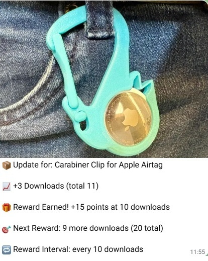
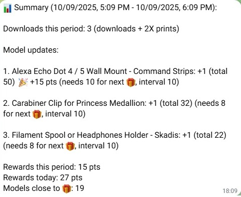
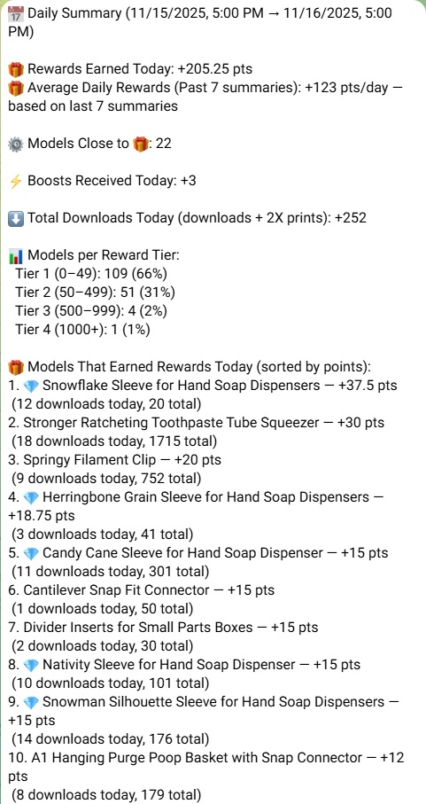

# MakerStats Notifier

A browser extension that actively monitors your MakerWorld model statistics and sends real-time notifications to a Telegram chat of your choice. Never miss a download, print, boost, or reward milestone again!

## ✨ Sample Notification

## ✨ Overview

This extension periodically collects data from your MakerWorld "My Models" page, and saves the status of your published designs. It keeps track of downloads, prints, and boosts, calculating progress towards reward point milestones. When an update is detected, it formats a detailed message and sends it directly to you via a personal Telegram bot.

## ✨ Key Features

* **Real-Time Monitoring**: Checks for changes in your model stats at a configurable interval.
* **Telegram Notifications**: Get updates via Telegram for:
    * New Downloads & Prints
    * Reward Point Milestones
    * Boosts on your models
* **Detailed Reward Tracking**: The extension calculates reward points earned based on MakerWorld's milestone system (e.g., +15 points at 50 downloads, +12 at 75, etc.). It clearly reports what you've earned and how far you are from the next milestone.
* **Two Notification Modes**:
    1.  **Per-Model**: Receive a separate, detailed notification with a model image for each update.
    2.  **Summary Mode**: Receive a single, aggregated report of all model changes during a check. This is automatically triggered if more than 15 models are updated at once (in order to stay within Telegram's message sending limits).
* **Daily Summary Report**: Get a scheduled daily digest summarizing the last 24 hours of activity, including top-performing models and total points earned.
* **Robust & Smart**:
    * Automatically scrolls the page to ensure *all* your models are loaded and tracked.
    * Intelligently handles large numbers of updates to prevent hitting API limits.
    * Includes a locking mechanism to prevent duplicate daily reports if you have the page open in multiple tabs.

---

## 🚀 Setup Guide

You'll need a Telegram Bot and your Chat ID to get started. It only takes a few minutes.

### Step 1: Create a Telegram Bot

1.  Open Telegram and search for the **@BotFather** user (it's the official bot for creating other bots).
2.  Start a chat with BotFather and send the `/newbot` command.
3.  Follow the prompts to choose a name and username for your bot.
4.  BotFather will provide you with a unique **Bot Token**. It will look something like `1234567890:ABCdE1FGh-iJkL2mN3oP4qR5sT6uV7wX8yZ`.
5.  **Copy this token and save it.**

### Step 2: Get Your Chat ID

1.  Search for the **@userinfobot** in Telegram.
2.  Start a chat with it and it will immediately reply with your user information.
3.  **Copy your `Id` (a string of numbers) and save it.** This is your personal Chat ID.
4.  *(Optional)*: You can also add your bot to a group chat and use a tool like @userinfobot to find the group's Chat ID (it will be a negative number).

### Step 3: Install the Extension

1.  Download the latest version of this extension from the **Releases** page on GitHub, and unzip the folder.
2.  Open your Chromium-based browser (Chrome, Edge, Brave, etc.) and navigate to the extensions page (`chrome://extensions` or `edge://extensions`).
3.  Enable **"Developer mode"** using the toggle switch, usually in the top-right corner.
4.  Click the **"Load unpacked"** button.
5.  Select the unzipped extension folder you downloaded.

### Step 4: Configure the Extension

1.  Click on the extension's icon in your browser toolbar to open the configuration popup.
2.  Enter the **Bot Token** and **Chat ID** you saved earlier.
3.  Adjust the settings to your preference.
4.  Click **"Save"**.
5.  Navigate to your MakerWorld "My Models" page and the monitor will start automatically!

---

## ⚙️ Configuration Options

All settings can be configured from the extension's popup. 

| Setting                 | Description                                                                                             | 
| ----------------------- | ------------------------------------------------------------------------------------------------------- | 
| **Telegram Bot Token** | The unique token for your Telegram bot, obtained from @BotFather.                                       | 
| **Telegram Chat ID** | The ID of the user or group that will receive the notifications.                                        | 
| **Refresh Interval** | How often the extension should check for new stats.                                                     | 
| **Notification Mode** | Choose between **Per-Model** updates or a single **Summary** report for each check.                     |
| **Daily Summary** | Enable or disable the daily 24-hour summary report.                                                     | 
| **Daily Summary Time** | The time of day (in your local timezone) when the daily summary should be sent.                         | 

---

## 📸 Example Notifications

### Milestone & Reward Notification (Per-Model Mode)

---

### Periodic Summary Report (Summary Mode)

---

### Daily Summary Report

---

## How it Works

- Every refresh cycle:

  1. The extension scrolls through your MakerWorld profile to load all models.
  2. It scrapes the stats (downloads, prints, boosts).
  3. Compares current values to previously stored ones.
  4. Sends Telegram updates if new activity is detected.
   
- It automatically generates and sends a daily report summarizing the last 24 hours.

## Interim Summary (Optional)

- Click the “Send Interim Summary” button in the popup.
- You’ll receive a Telegram message with mid-day progress (downloads, prints, and rewards so far).

## Notes

### Summary Mode

Summary Mode shows points that are earned and accumulated throughout the day. It measures the start of the day from the time of the last 24-hour update. It has nothing to do with any calendar or the actual time of day. It is a timer. So the accumulated stats will reset after each 24-hour summary is sent (with a bit of data saved as a failsafe).

### Setting the Interval

You can set the interval for periodic updates to any of these periods: 5 minutes, 10 minutes, 15 minutes, 30 minutes, 1 hour, 2 hours, 3 hours, 4 hours. 

The interval you choose (and whether you use summary mode) will likely be impacted by how many models you have, and how many updates you are likely to receive. 

If you set the interval to something on the long side (like 3 or 4 hours), and you have a lot of models, you could get extensive updates, even in summary mode. If it gets to be too many, and approaches the per message size limit for Telegram, the extension should automatically break the update into parts and send them separately. But you may want to shorten the interval in order to make this easier to manage. 

### “Models close to 🎁”

When in Summary Mode, the extension counts and reports the number of models that are within 1 or 2 downloads of receiving reward points. I like tracking this number, as it helps me see how my models are doing in a "big picture" way. And it helps me see if the pipeline is running low due to fewer new models (where the points come quicker). Downloads are defined as actual downloads + 2x prints, as MakerWorld tracks them for purposes of rewards. 

### The Extension Only Tracks Models

The extension only tracks prints and downloads for models on MakerWorld. It does not track print profiles or the points received for "high quality" print profiles. Because of this, the number of points you actually receive will often be higher than the extension shows. 

### Time Creeping

Periodic updates are sent according to the interval you set, for whatever period you want. For example, if you use a 1 hour interval, the actual time when you receive the updates will creep a bit as the days go by. This is because it takes some time to load the page, scrape and store the data, send updates, etc (it is mostly extra time for loading the page completely). So if you start the extension at 1 pm, over time you will find the updates coming at 1:03 pm, or 1:07 pm. It will keep getting a bit later, because the extension just uses a timer and not a real clock. FYI. The exact time does not really matter, in most cases, so I am leaving it as is. The 24-hour summary does rely upon the clock and should always update at about the time you set. 

### Points Prediction

I like to set my 24-hour Summary to be delivered at the time (in my timezone) that corresponds to UTC+0, because that is the time when (as I understand it) a new day starts (for counting points) at MakerWorld. Given that the points I earn today will not be awarded until tomorrow (according to MakerWorld policy), this schedule is handy for giving me advance notice for the amount of points my models will receive tomorrow. 

### Heartbeat

I like feedback. So if the periodic refresh happens, and no changes to your models are detected, the extension sends a message anyway. It says "No new prints or downloads found."

### Prevent Background Throttling (Important!)

Chrome aggressively throttles background tabs and inactive windows.
When this happens, the extension may fail to fully load all models on your MakerWorld page (you’ll notice missing or incomplete updates). 

I try to manage this by running the extension in a separate instance of Chromium that doesn't run anything else. 

But you can also help prevent this behavior by launching Chrome with the following flags:

    --disable-background-timer-throttling
    --disable-renderer-backgrounding
    --disable-backgrounding-occluded-windows

#### Why These Flags Matter

| Flag                 | What It Does                                                                                             | 
| ----------------------- | ------------------------------------------------------------------------------------------------------- | 
| **--disable-background-timer-throttling** | Keeps JavaScript timers running at full speed even when the tab is in the background.                                       | 
| **--disable-renderer-backgrounding** | Prevents Chrome from deprioritizing background tab rendering (ensures the MakerWorld page keeps updating).                                        | 
| **--disable-backgrounding-occluded-windows** | Ensures backgrounded or minimized windows are not treated as “occluded,” which can stop them from executing code normally.

#### How to Use Them

1. Close Chrome completely.

2. Start Chrome from the command line with those flags.
   
    ##### Windows example:

    "C:\Program Files\Google\Chrome\Application\chrome.exe" 
          --disable-background-timer-throttling 
          --disable-renderer-backgrounding 
          --disable-backgrounding-occluded-windows

    ##### macOS example:

    /Applications/Google\ Chrome.app/Contents/MacOS/Google\ Chrome \
          --disable-background-timer-throttling \
          --disable-renderer-backgrounding \
          --disable-backgrounding-occluded-windows

    ##### Linux example:

    google-chrome \
          --disable-background-timer-throttling \
          --disable-renderer-backgrounding \
          --disable-backgrounding-occluded-windows

3. Keep Chrome running in this mode whenever you want the extension to monitor MakerWorld reliably.

## Troubleshooting

| Issue                 | Possible Fix                                                                                             | 
| ----------------------- | ------------------------------------------------------------------------------------------------------- | 
| **No Telegram messages** | Verify token and chat ID, ensure your bot is started in Telegram.                                       | 
| **Too many small updates** | Enable Summary Mode to bundle notifications.                                        | 
| **Duplicate reports** | Normal if multiple browser instances run; lock prevents double sends.
| **Images missing in messages** | MakerWorld may restrict direct image URLs; Telegram falls back to text. Summary mode does not include images                                        | 

## Support

If you find this extension useful, please consider [boosting one of my models](https://makerworld.com/en/@thczv/upload), or [buying me a coke](https://www.venmo.com/u/ThczvDesigns) (I'm not much of a coffee drinker)

---

## License and Attribution

This extension is a modified version of Aquascape123's excellent [Makerworld Telegram Notifier](https://github.com/aquascape123/makerworld-telegram-notifier). 

It is provided at no charge under the MIT license. 

